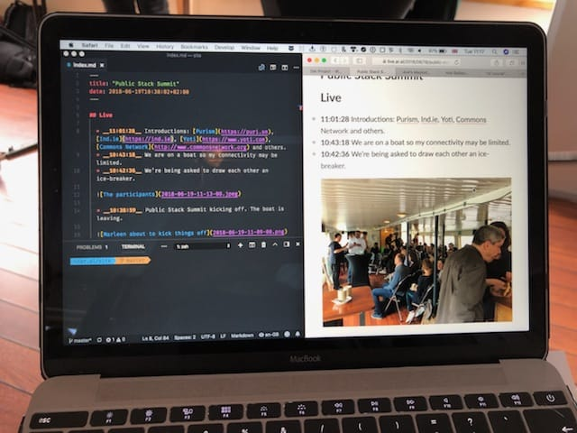
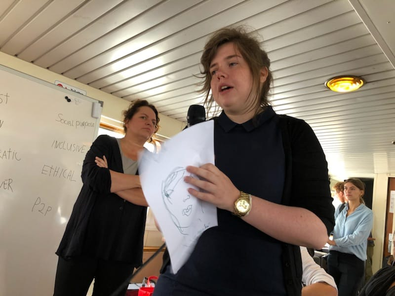
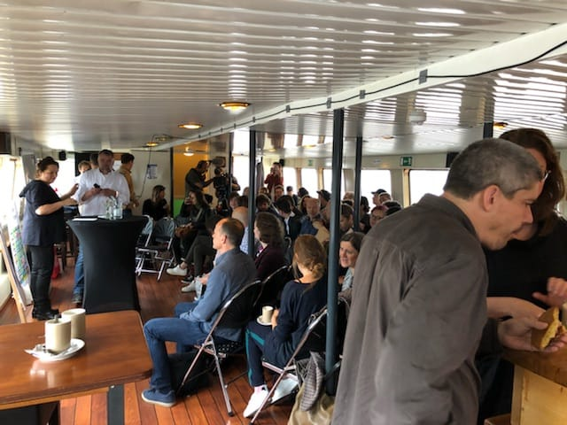
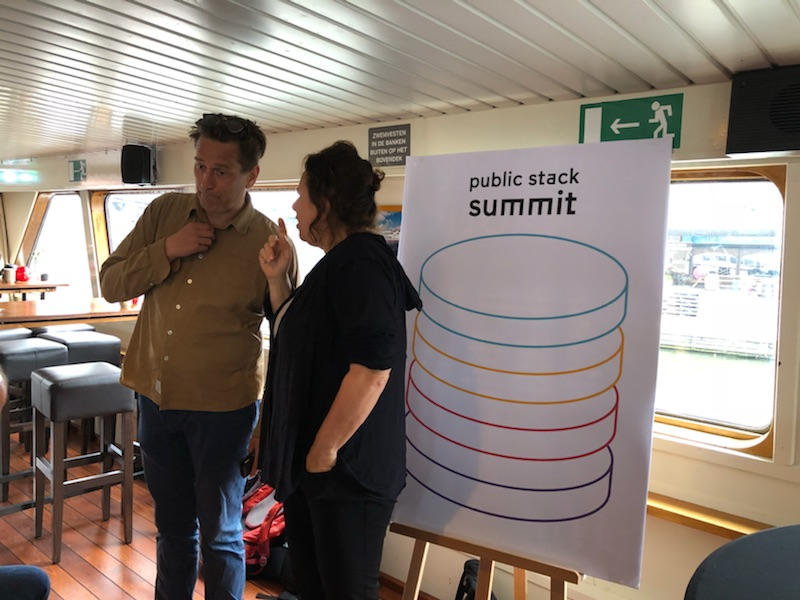

_This post was live blogged. Entries are in reverse chronological order._

### 14:22:43

Katja, Laura, Todd and myself had a lively conversation about what constitutes a public stack and presented it. Core principles: individual ownership/control and convenience. A main challenge is protecting personhood in the digital age. Personhood is a prerequisite to the social contract. Individual sovereignty is a necessary (but not sufficient) prerequisite for a healthy commons.

Other teams raised points including: keeping values at the core of the stack (see [Ethical Design Manifesto](https://ind.ie/ethical-design)), ethics in sourcing and manufacture (see [Fairphone](https://fairphone.org)).

### 11:28:29

I’m going to take a little break now so I can participate more directly. Will update if and when I have something interesting to share.

### 11:25:23

This is how I’m [live blogging](https://ar.al/2018/06/15/hello-peer-to-peer-web/) with Hugo, rsync, and [DAT](https://datproject.org), by the way.

### 11:17:57

Katja from [Nesta](https://www.nesta.org.uk) introducing herself. Laura and I will be at the [FutureFest](https://www.futurefest.org) conference they’re organising in London soon.

### 11:01:28

Introductions: [Purism](https://puri.sm), [Ind.ie](https://ind.ie), [Yoti](https://www.yoti.com), [Commons Network](http://www.commonsnetwork.org) and others.
### 10:43:18

We are on a boat so my connectivity may be limited.
### 10:42:36

We’re being asked to draw each other an ice-breaker.

### 10:38:59

Public Stack Summit kicking off. The boat is leaving.

