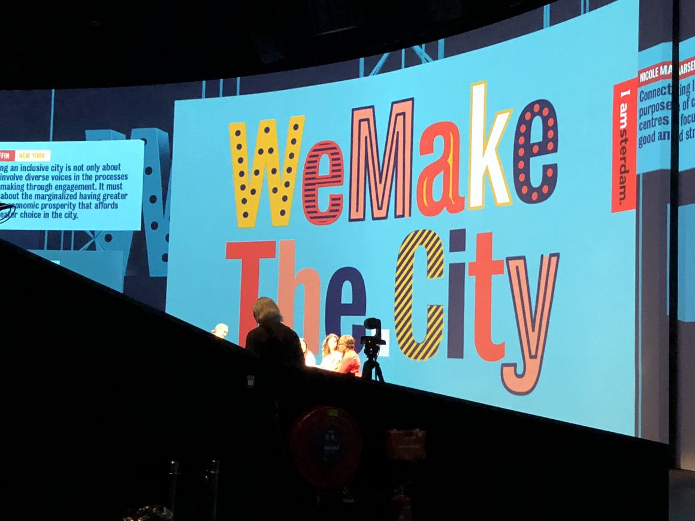

Last night, I was mostly positively surprised by the opening night of the We Make The City festival in Amsterdam. [I was expecting a wholly neoliberal affair](https://twitter.com/aral/status/1009483631776141312) and it didn’t turn out that way.



After speaking at at least two conferences together, I finally got to see [Kate Raworth](https://www.kateraworth.com) present on Doughnut Economics (for the city). It was great to see her directly address the need to move from centralised to distributed/decentralised systems.





In a refreshing all-female line-up, the evening included mostly progressive discourse.



Inexplicably, in the middle of this, we were presented by the CTO of Dubai in what I can only describe as a major whitewashing PR win for Dubai. Needless to say, there is nothing progressive about Dubai or the UAE. On stage, when asked about concerns about Big Brother-like surveillance, the CTO of Dubai responded with “We don’t call it Big Brother, we call it Fatherhood” to the sound of gasps from the audience.

Today, I am going to be taking part in the [Next Generation Cities](https://wemakethe.city/nl/programma-item?programid=4193) event as well as an evening event before returning to Ireland tomorrow.
