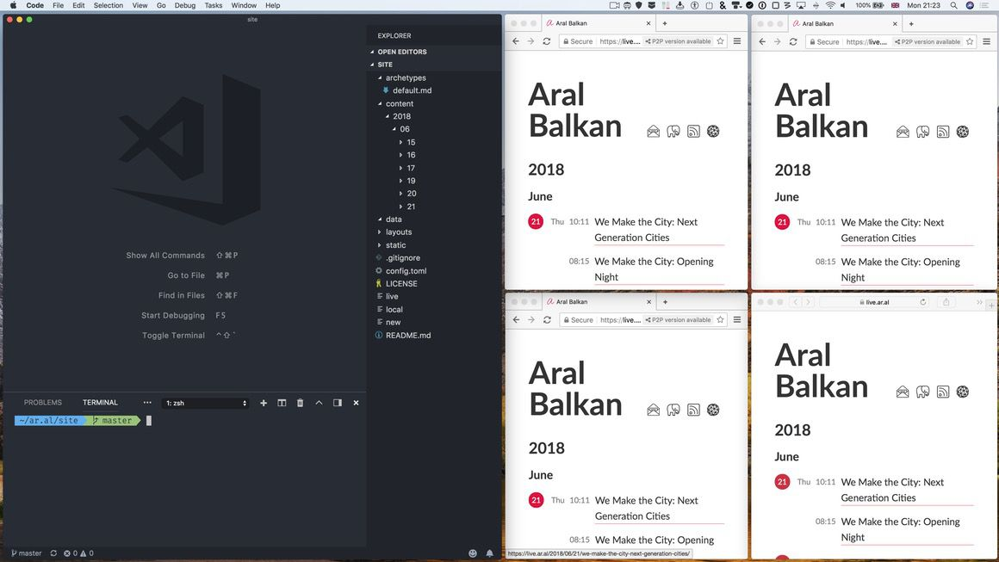

This is a short demonstration to show live reload and the peer-to-peer features of my new blog using Web + DAT.

***

### 21:41:16

The above content was created as part of a screen recording for my talk at Nesta’s FutureFest at the start of July. As part of the talk I will be showing this blog which progressively enhances the Web with peer-to-peer functionality using [DAT](http://datproject.org).

In the recording (which I’ve just finished and haven’t even exported from [Screenflow](http://www.telestream.net/screenflow/overview.htm) yet), I show how changes to my posts are almost immediately reflected in [Beaker Browser](https://beakerbrowser.com/) when live reload is on whereas, with a plain web browser like Safari, you have to refresh manually.

Also, while a growing number of people manually refreshing a site would create increasing load for the site, on the peer-to-peer web, the load is distributed. Unlike the old web, the more popular a site gets, the better it performs, without requiring additional resources from the site itself.

In the talk I will also touch upon the importance of content-addressing and the peer-to-peer nature of DAT in relation to censorship prevention and network resilience in general.
