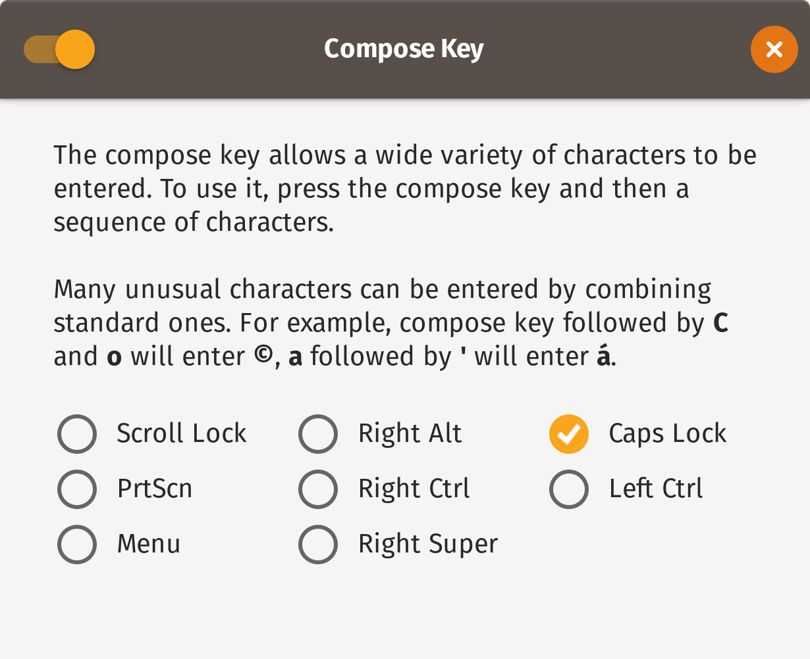



Typography lends us the voice that the written word takes away from us. Good typography makes your message accessible and comprehensible and strengthens its intent. Bad typography can have the opposite effect: it can cloud your meaning and give you a raspy voice.

I first started making an effort to write using semantic typographical habits [about six years ago](http://www.breakingthin.gs/2012-07-13-on-practicality.html). This involved, among other things, memorising the various keyboard shortcuts on macOS for printing typographical quotes instead of typewriter quotes and using en dashes, em dashes, and the minus sign for their allotted purposes instead of hyphen-dashes for everything like a caveman that thinks everything is a nail because all he has is a tiny little club[^1].

Switching to Linux means that I have to learn new habits[^2].

Some environments provide automatic conversion of such things (i.e, “smart quotes” functionality) and some even do it well. I strongly support such efforts and believe they should be the norm. However, it’s still a good habit to get into to write using semantic typography to begin with. Not least because smart quotes is not a universal feature and even the best implementations won't necessarily cover all typographical elements.

### Alt Graph and Compose keys

When seeking to develop good typographical typing habits on Linux, you have two friends you can count on: the [Alt Graph key](https://en.wikipedia.org/wiki/AltGr_key) (<kbd>AltGr</kbd>) and the Compose key.

More than likely, if you're not on a touch-based device, you can see the <kbd>AltGr</kbd> key on the keyboard in front of you. You might be wondering about the other one, however. That's because the Compose doesn't exist on modern keyboard. You can, however, easily map an existing key to be your compose key under Gnome. We’ll see how after the next section.

### The Alt Graph Key

Let's start with the simpler of the two methods; the one that works right out of the box.

The <kbd>AltGr</kbd> key modifier, combined with the <kbd>Shift</kbd> key modifier, exposes two separate layers of characters on the keyboard. Using the <kbd>AltGr</kbd> key, you can easily enter a number of useful everyday characters including the following[^3]:

Key(s)                        | Character | Description
----------------------------- | --------- | -------------------------
<kbd>v</kbd>                  |	“	        | Open double curly quotes
<kbd>b</kbd>	                | ”	        | Close double curly quotes
<kbd>Shift</kbd> <kbd>v</kbd> |	‘	        | Open single curly quote
<kbd>Shift</kbd> <kbd>b</kbd>	| ’	        | Open single curly quote
<kbd>Shift</kbd> <kbd>3</kbd> | #         | Octothorpe
<kbd>,</kbd>                  |	─	        | Minus
<kbd>Shift</kbd> <kbd>,</kbd>	| ×	        | Multiplication
<kbd>.</kbd>                  |	·	        | Middle dot
<kbd>Shift</kbd> <kbd>.</kbd>	| ÷	        | Division
<kbd>Shift</kbd> <kbd>c</kbd> | ©         | Copyright
<kbd>y</kbd>	                | ←         |	Left arrow
<kbd>i</kbd>	                | →	        | Right arrow
<kbd>u</kbd>	                | ↓	        | Down arrow
<kbd>Shift</kbd> <kbd>u</kbd>	| ↑	        | Up arrow

So those are glyphs that you can start to use right away via the <kbd>AltGr</kbd> key. For the second method, you’re going to have to install a Gnome app.

### The Compose Key



The Compose key, introduced in 1983, never became a standard but it is hugely useful and rather delightful to use nevertheless. It's based on the concept of using a mnemonic sequence of easy-to-type characters to specify glyphs that are not readily available on your keyboard.

To set up and use your Compose key:

1. Install and launch [Gnome Tweaks](https://wiki.gnome.org/Apps/Tweaks)

2. Navigate to _Keyboard &amp; Mouse_ and choose a _Compose Key_.

<figure class='half-width-flush-right'>
  
  <figcaption>
Turn it on and choose a key.
</figcaption>
</figure>

Initially, I set my Compose key to <kbd>Scroll Lock</kbd> while using my external keyboard[^4], only to discover that my laptop didn’t have one. So now I use <kbd>Caps Lock</kbd>, an otherwise rather useless key when you think about it.

To enter extended characters with this method, you press the Compose key followed by a key combination. The key combinations are delightfully clever and make a huge amount of sense.

Here are some examples of the most useful ones I’ve discovered so far:

Keys  | Keys (spelled out)  | Character | Description
----- | ------------------- | --------- | -----------
--.   | dash-dash-dot       | –         |	en-dash
---	  | dash-dash-dash      |	—	        | em-dash
..	  | dot-dot             |	…	        | ellipsis
.-	  | dot-dash            | ·	        | middle dot
.=	  | dot-equals		      | •	        | filled bullet
oc	  | o-c			            | ©	        | copyright
tm	  | t-m			            | ™	        | trademark
c=	  | c-equals		        | €	        | Euro
c/	  | c–forward slash	    | ¢	        | Cent
l-	  | l-dash			        | £	        | Pound
->	  | dash–greater than   |	→	        | Right arrow
-<	  | less than-dash      |	←	        | Left Arrow
xx	  | x-x			            | ×	        | Multiplication
-:	  | dash-colon		      | ÷	        | Division
=/	  | equals–forward slash|	≠	        | Not equal to
12	  | one-two		          | ½	        | Half
34	  | three-four		      | ¾	        | Three quarters
^0	  | caret-zero		      | ⁰	        | Superscript zero
^9	  | caret-nine		      | ⁹	        | Superscript nine

If the built-in ones do not meet your needs, you can also add [custom Compose key sequences](https://askubuntu.com/questions/47496/how-can-i-add-a-custom-compose-key-sequence#71335).

I hope you find this useful and that it helps you express yourself better while typing on a Linux machine. If you have any favourite glyphs that I’ve missed, [let me know via Mastodon](https://mastodon.ar.al).

[^1]: Yakub Marian has a beautifully-written and comprehensive article titled [Hyphen, minus, en-dash, and em-dash: difference and usage in English](https://jakubmarian.com/hyphen-minus-en-dash-and-em-dash-difference-and-usage-in-english/) that I strongly urge you to read.

[^2]: And that's part of the fun. You always learn the most when you force yourself outside of your comfort zone. In the last two weeks alone I've learned heaps about how operating systems boot (due to an issue I had while trying to install first Ubuntu 18.04 and then [Pop!_OS](https://system76.com/pop) on my XPS 13) and about flashing ROMs onto mobile phones. (I'm also switching my main phone to [LineageOS](https://lineageos.org/) and I had an issue with the camera not working on my S9+ so [I had to revert back to the stock ROM](/2018/07/15/flashing-stock-firmware-onto-a-samsung-galaxy-s9+-sm-g965f-on-ubuntu-18.04-using-heimdall/).)

[^3]: The key sequences listed in the Alt Graph Key section are from my keyboard layout, which is English (UK, Macintosh). The actual physical keyboard layout I use is ISO. The exact combinations may vary depending on specific setup.

[^4]: The excellent [Filco Majestouch](https://deskthority.net/wiki/Filco_Majestouch) 2 Ninja Tenkeyless.

### References

* [How to type smart quotes on Ubuntu Linux](https://alvinalexander.com/linux-unix/how-to-smart-quotes-on-ubuntu-keystrokes-macros)
* [How to set a Compose Key in Ubuntu 18.04](https://askubuntu.com/questions/1028957/how-to-set-a-compose-key-in-ubuntu-18-04)

### Credits

  * [Old typewriter](https://skitterphoto.com/photos/2332/old-typewriter) by [Peter Heeling](https://skitterphoto.com/photographers/7/peter-heeling).

