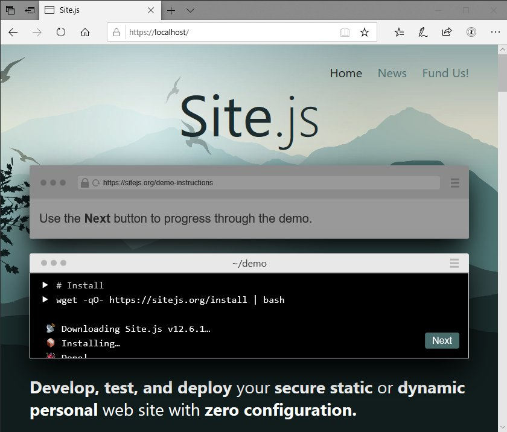
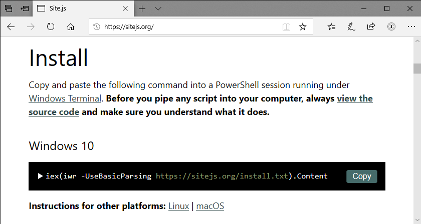
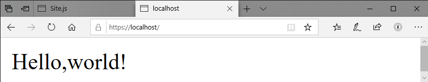
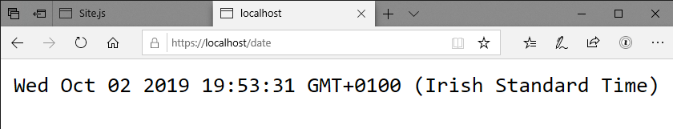

Last week, I bought myself a refurbished 7-year-old ThinkPad 440p[^1] to test [Site.js](https://sitejs.org) under Windows.

Long story short, Windows is still shit[^2], plus it’s now also a cesspit of surveillance[^3], and over the weekend, I ended up adding native Windows 10 support[^4] to Site.js[^5].

So if you’re on Windows 10 – out of necessity or preference – follow along for a quick look at how you can create your own static and dynamic web site using Site.js in a minute or two.[^6]

### 1. Install Site.js (~15 seconds)

[Skim the source code for the installer](https://sitejs.org/install.txt) and, when you’re happy it’s not doing anything nefarious, copy and paste the following command into a PowerShell session running under [Windows Terminal](https://github.com/microsoft/terminal)[^7]:


iex(iwr -UseBasicParsing https://sitejs.org/install.txt).Content


### 2. Create and test your first static site (~ 30 seconds)

Enter the following three commands into your terminal:


# Create a demo folder to work in and switch to it.
mkdir demo; cd demo

# Create a static index route.
Set-Content index.html 'Hello, world!'

# Start serving your site with Site.js.
site


Visit your new static site at `https://localhost`.

When you’re ready to move on, press `Ctrl+C` to stop Site.js.

### 3. Create and test your first dynamic site (~1 minute)

We’re going to use [DotJS](https://sitejs.org/#dynamic) to create a dynamic route. In Site.js, dynamic routes are placed in a folder called `.dynamic` in your site’s root.


# Create the .dynamic folder.
mkdir .dynamic

# Create a dynamic route that displays the current time/date.
Set-Content ./.dynamic/date.js 'module.exports = (_, res)=>{res.end(`<pre>${new Date().toString())}</pre>`)}'

# Start Site.js.
site


Visit your new dynamic route at `https://localhost/date`.

Refresh to see that the date changes.

I wrote that route in a rather obfuscated way for brevity. Here it is re-written for clarity and better compatibility:


module.exports = (request, response) => {
  const now = new Date().toString()
  response
    .type('html')
    .end(`<pre>${now}</pre>`)
}


### There’s no magic…

DotJS routes map simple `.js` files (see what I did there) to [Express](https://expressjs.com/) routes. All you have to do is to write the logic for the route itself. Site.js takes care of all the plumbing.

Using DotJS, you can specify [HTTPS GET and POST routes](https://source.ind.ie/site.js/app/blob/master/README.md#get-and-post-routes) as well as [secure WebSocket routes](https://source.ind.ie/site.js/app/blob/master/README.md#websocket-wss-routes).

If you need full flexibility in your routing, you can do anything you can with Express and [Express-WS](https://github.com/HenningM/express-ws) using [advanced routing](https://source.ind.ie/site.js/app/blob/master/README.md#advanced-routing-routesjs-file).

I hope you enjoy using Site.js on Windows 10 and remember that you can use everything you’ve just learned on Linux and macOS too. In fact, there are a couple of things you can do on those platforms that you cannot on Windows 10.

## Windows 10 Limitations

On macOS and Linux, you can [sync your local site to your remote server](https://source.ind.ie/site.js/app/blob/master/README.md#deployment-live-and-one-time-sync). This is not possible on Windows 10 as there isn’t a free and open [rsync](https://en.wikipedia.org/wiki/Rsync) implementation that we can use.

Also, on Linux distributions with [systemd](https://freedesktop.org/wiki/Software/systemd/) (e.g., Ubuntu 18.04 LTS), you can run production servers. In fact, that’s how this post is being served to you right now.

This blog, [Laura’s site](https://laurakalbag.com), and the [Small Technology Foundation web site](https://small-tech.org) are all powered by Site.js.

## Next steps

To learn more about Site.js, read through the [Site.js web site](https://sitejs.org) (and try out the interactive demo in the header), [read the Site.js documentation](https://source.ind.ie/site.js/app/blob/master/README.md), and feel free to [hit me up on my Mastodon](https://mastodon.ar.al/@aral) if you have any questions.

## Like this? Fund us!

Small Technology Foundation is a tiny, independent not-for-profit.

We exist in part thanks to patronage by people like you. If you share our vision and want to support our work, please [become a patron or donate to us](https://small-tech.org/fund-us) today and help us continue to exist.

[^1]: It was the cheapest way I could test under Windows, given that a license of Windows 10 Pro costs basically what I paid for it. And, I have to say, it runs like a champ.

[^2]: Part of “having been around” is having started out on DOS at age 7 and stubbornly spent twenty odd years on DOS/Windows before overcoming my Stockholm syndrome.

[^3]: But that’s a story for a different post. And yes, I have the screenshots.

[^4]: Note that Windows Subsystem for Linux (WSL) is not supported. Site.js uses [mkcert](https://github.com/FiloSottile/mkcert) to seamlessly provision development-time TLS certificates. The way mkcert does this is to unceremoniously create a certificate authority on your local machine. The problem is that under WSL, the certificate authority gets created under Linux, not Windows. And then you go and run your browser of choice under Windows and, oops, you get a certificate error. This is not a trivial issue to fix. If the mkcert folks add support for WSL in the future, Site.js should also benefit. Until then, Site.js won’t be supporting WSL.

[^5]: Now, you might be asking yourself: “Aral, if you hate Windows so much, why did you spend time supporting it?” And my answer to that is when you’re building a bridge to a better place, you can’t have both its feet on the shore you want to get to. You have to plant one of them on the shore you want to get away from.

    Case in point: I wouldn’t have been able [to switch to Mac in 2006](https://ar.al/681/) if it hadn’t been for cross-platform free and open source tools making the transition easier and Parallels enabling me to run Windows alongside OS X until I was ready to cut the cord entirely.

    This is also why I talk about Tincan being a bridge from the centralised web to the peer web.

    It’s no use building islands of utopia if the only people who can reach them are master swimmers. Our biggest challenge is building bridges. And that sometimes means spending time in places we would rather not.

[^6]: On Linux and macOS, you can install Site.js with a single-line installation command that you copy from the web site. I wanted the Windows version to be as easy. This does mean the installer does a couple of “clever” things out of necessity like re-downloading itself and then launching the saved script in an elevated process to carry out the installation with administrator privileges. As far as the experience is concerned, it should be seamless. Please do let me know if it isn’t for you.
